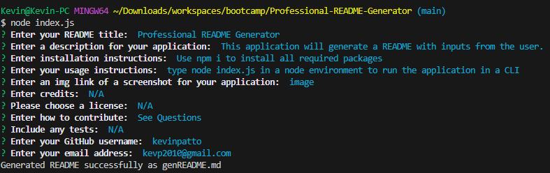

# Professional README Generator
## Description
This application makes it much easier to create a professional README just by answering a few questions. Now I can quickly create a README for my projects from scratch and modify the result as I see fit afterwards. I learned how to use Inquirer's methods which gave me an insight into promises. 
## Table of Contents
- [Installation](#installation)
- [Usage](#usage)
- [Credits](#credits)
- [License](#license)
## Installation
Use `npm i` to install all required packages
## Usage
Type node index.js in a node environment to run the application in a CLI. Enter answers to the questions as they come up and hit enter to move on to the next one. Use the arrow keys (or the spacebar) to cycle through choices and enter to select from a list. Once complete, a file will be generated with the name "genREADME.md". Remove "gen" if you wish to use it as your README.

## Credits
N/A
## License
N/A